# 人工智能项目教程

本教程主要介绍一些入手人工智能相关项目所需的必要`软件`及`知识`储备，用于帮助新人快速入门或上手相关项目。如果你想更加全面的了解人工智能项目开发相关的技术，也可以根据本教程提到的一些关键词自行搜索学习。

## 目录

- [软件安装](#软件安装)
- [Python 环境配置](#python-环境配置)
- [项目开发相关知识](#项目开发相关知识)
  - [Git 相关](#git-相关)
  - [镜像资源修改](#镜像资源修改)
  - [Python 性能测试](#python-性能测试)
- [常用软件介绍](#常用软件介绍)
  - [Open Babel](#open-babel)
- [学习资料推荐](#学习资料推荐)
  - [Python 编程语言](#python-编程语言)
  - [Python 数据分析](#python-数据分析)
  - [Python 网络爬虫](#python-网络爬虫)
  - [Python 机器学习](#python-机器学习)
  - [拓展书目](#拓展书目)
- [常用库介绍](#常用库介绍)
  - [Scikit-Learn](#scikit-learn)
- [常用库的在线手册](#常用库的在线手册)
- [奇怪的技巧](#奇怪的技巧)

## 软件安装

### 集成开发环境（IDE）配置

鉴于现阶段人工智能项目主要基于[Python](https://www.python.org/)编程语言进行开发，我们推荐入门人员首选安装[Pycharm](https://www.jetbrains.com/pycharm/)并配置[Conda](https://www.anaconda.com/products/distribution)环境使用。另外，除了`Python`以外，项目开发过程中还会使用其他的编程语言（如`C++`，`Javascript`等）、标记语言（如`XML`、`HTML`等）以及特殊的文件格式（如`Json`等），而[Vscode](https://code.visualstudio.com/)因为有丰富的插件库用以支持上述语言及文件格式，所以我们也推荐新手安装[Vscode](https://code.visualstudio.com/)。

下面将就`Pycharm`，`Conda`以及`VScode`的安装及使用进行简单的说明。

#### Pycharm 的安装

浏览器输入 https://www.jetbrains.com/pycharm/ 进入 Pycharm 的下载页面，根据电脑系统选择下载 Windows，MACOS 还是 Linux 版本。

<div align=center>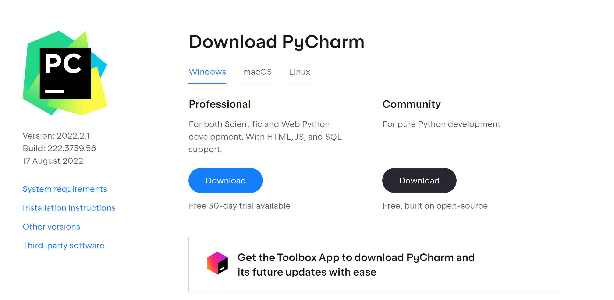</div>

**Note**

> 安装 Pycharm 社区版即可

#### Anaconda 的安装

浏览器输入 https://www.anaconda.com/products/distribution 进入 Anaconda 的下载页面，点击`Download`会自行下载电脑适配版本。

<div align=center>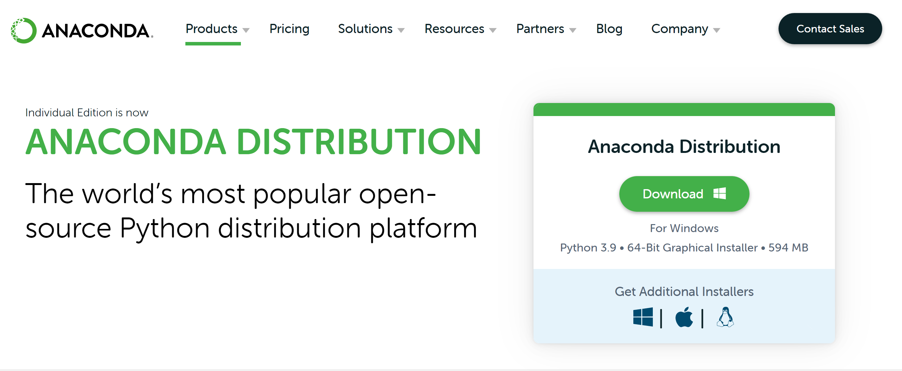</div>

**Important**

> 在安装 Anaconda 过程中，注意勾选将 Anaconda 加入 PATH 环境变量，安装结束之后可查看系统环境变量确认

<div align=center>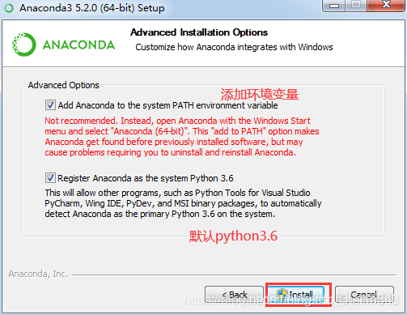</div>

> 系统环境变量查找路径：此电脑-属性（右键单击）-高级系统设置-环境变量-Path 环境变量（双击可查看）

<div align=center>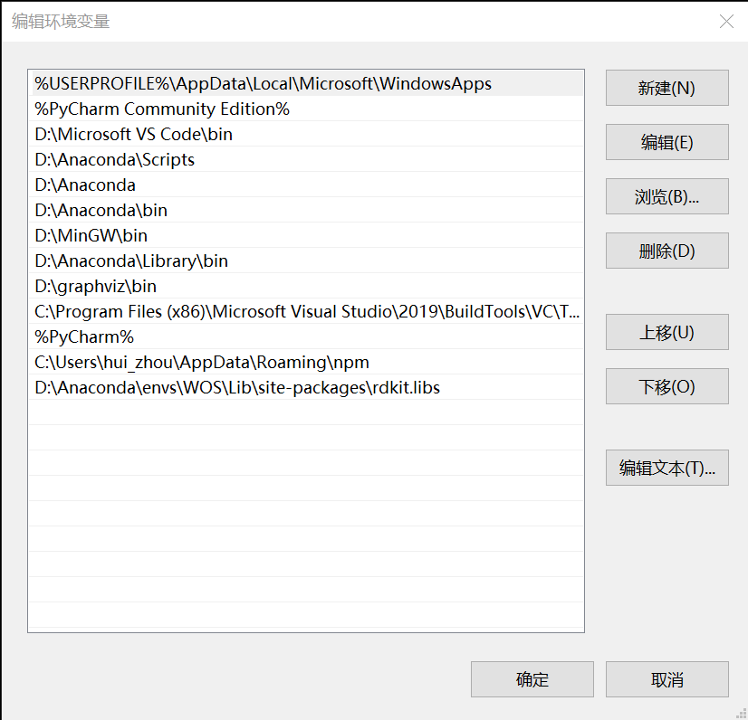</div>

#### VScode 安装 (可选，建议安装)

浏览器输入 https://code.visualstudio.com/ 进入 VScode 的下载页面，单击`Download for Windows`即可下载 Windows 版本的 VScode。

<div align=center>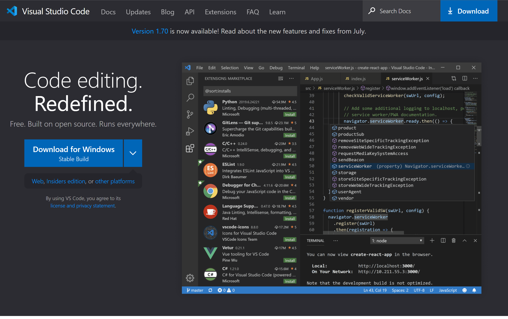</div>

### VSCode 插件安装

与 Pycharm 不同，VScode 的强大主要得益于其具有丰富且优秀的插件来帮助开发者更便利的开展项目开发。

在 VSCode 中进行插件安装特别简单，只需要在`插件搜索栏`中输入你想安装的插件名字，即可进行安装。`插件搜索栏`如图中红框所示：

<div align=center>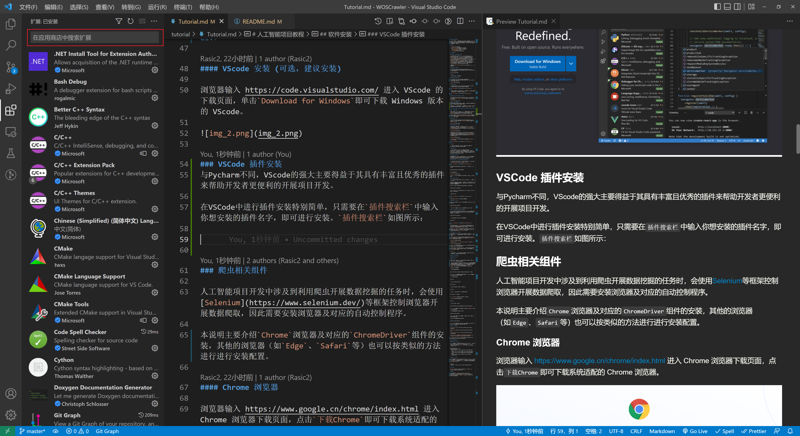</div>

推荐安装的 VSCode 插件：

- [C/C++: 官方 C/C++语言插件](https://github.com/Microsoft/vscode-cpptools.git)
- [Python: 官方 Python 语言插件](https://github.com/Microsoft/vscode-python)
- [Prettier: 代码格式化插件](https://prettier.io/)
- [Markdown Preview Enhanced: Markdown 预览插件](https://shd101wyy.github.io/markdown-preview-enhanced/#/)
- [Git Graph: 查看 Git 提交历史插件](https://marketplace.visualstudio.com/items?itemName=mhutchie.git-graph)
- [Live Server: 本地服务器插件](https://github.com/ritwickdey/vscode-live-server.git)
- [Code Spell Checker: 检查拼写插件](https://github.com/streetsidesoftware/vscode-spell-checker.git)

### 爬虫相关组件

人工智能项目开发中涉及到利用爬虫开展数据挖掘的任务时，会使用[Selenium](https://www.selenium.dev/)等框架控制浏览器开展数据爬取，因此需要安装浏览器及对应的自动控制程序。

本说明主要介绍`Chrome`浏览器及对应的`ChromeDriver`组件的安装，其他的浏览器（如`Edge`、`Safari`等）也可以按类似的方法进行进行安装配置。

#### Chrome 浏览器

浏览器输入 https://www.google.cn/chrome/index.html 进入 Chrome 浏览器下载页面，点击`下载Chrome`即可下载系统适配的 Chrome 浏览器。

<div align=center></div>

#### ChromeDriver 组件

ChromeDriver 组件需要和对应版本的 Chrome 浏览器一起搭配使用，因此安装完`Chrome`浏览器之后，点击`浏览器-设置-关于Chrome`查看安装的 Chrome 版本，例如我当前的 Chrome 版本号为`104.0.5112.82`。

<div align=center>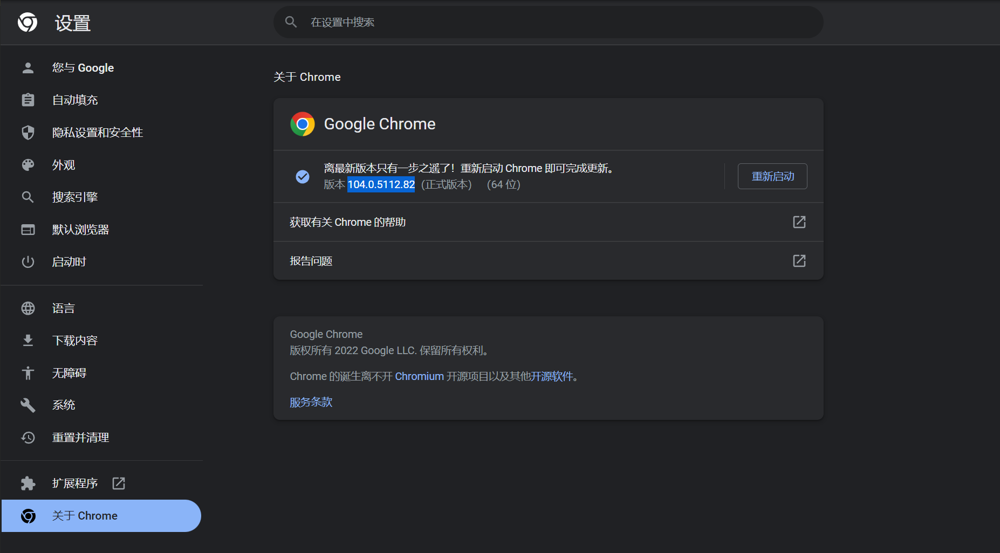</div>

确认安装的`Chrome`版本后，浏览器输入 http://chromedriver.storage.googleapis.com/index.html 进入`ChromeDriver`下载页面，根据 Chrome 版本号选择 ChromeDriver 版本，如果没有对应的版本，选择最相近的版本，例如我这里选择`104.0.5112.79`文件夹进入。

<div align=center>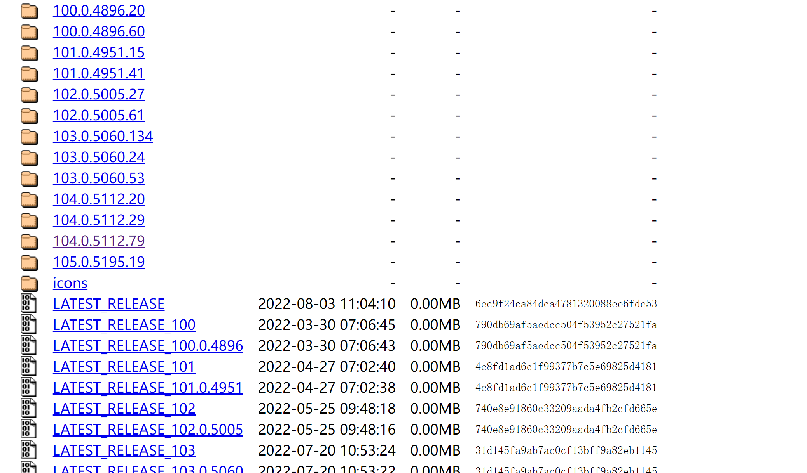</div>

进入`104.0.5112.79`之后，即可选择对应系统的`ChromeDriver`进行下载安装。

<div align=center></div>

**note**

> 所谓的 ChromeDriver 其实就是一个压缩包，里面存放有 chromedriver.exe（Win32 版本）文件。

**important**

> 为了在 Python 环境下使用 ChromeDriver，请将 chromedriver.exe 的位置加入到上述提到的 PATH 环境变量中（另一个更为简单的方法是把该 exe 文件直接放到 conda 目录下的 Scripts 文件夹中（已加入 PATH 环境变量），例如我计算机的位置：D:\Anaconda\Scripts）。

## Python 环境配置

下面将就如何利用 conda 配置 Python 环境进行说明，首先介绍 PowerShell 中 conda 的配置，然后讲述 conda 的一些常用命令，最后介绍如何利用 Pycharm 配置 Conda 环境。

### PowerShell 中配置 Conda（Windows 平台）

对于 Windows 平台，初次使用 conda 时，首先在任务栏的搜索框中搜索`PowerShell`，点击`以管理员身份运行`

<div align=center>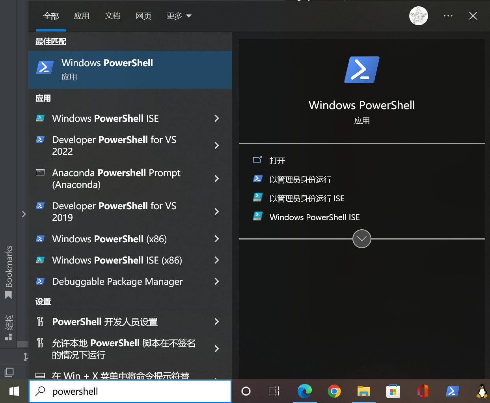</div>

然后输入以下命令（目的是将 powershell 和 anaconda 进行关联）：

```
Set-ExecutionPolicy RemoteSigned
```

会显示如下界面：

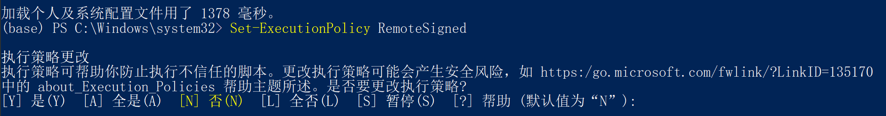

选择`Y`进行确定，之后就可以在 PowerShell 中正常使用 conda 了。

### Conda 创建新环境

启动 conda 时，默认显示的是 base 环境，即上图第二行最左侧的`(base)`。

对于项目开发来说，我们推荐每一个项目都在一个新的环境下开发，这可以极大的避免项目之间因为所需的 Python 以及 Python 包的版本不同而产生冲突。

conda 中创建新环境（例如 python38）可以使用下述命令：

```
conda create -n python38
```

创建好`python38`环境后，如果想查看当前 conda 的所有环境，可以使用下述命令：

```
conda env list
```

<div align=center>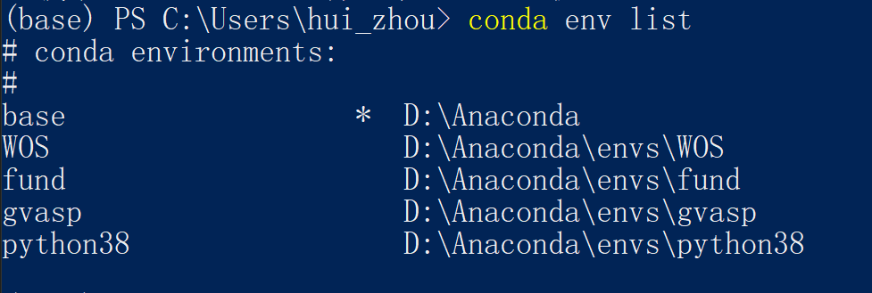</div>

可以看到，`python38`环境已经创建成功啦。

### Conda 激活环境

当我们想使用新的`python38`环境时，需要先激活该环境，使用下述命令：

```
conda activate python38
```

激活后，`PS`符号左侧的`(base)`就会变成`(python38)`。

### 使用 Conda 安装 Python 及各种包

对于新创建的环境默认是没有 Python 的，所以我们首先需要安装 Python，利用 Conda 安装 Python 时我们可以同时指定 Python 的版本，使用下述命令：

```
conda install python=3.8
```

使用下述命令查看 python 是否安装成功：

```
conda list
```

<div align=center>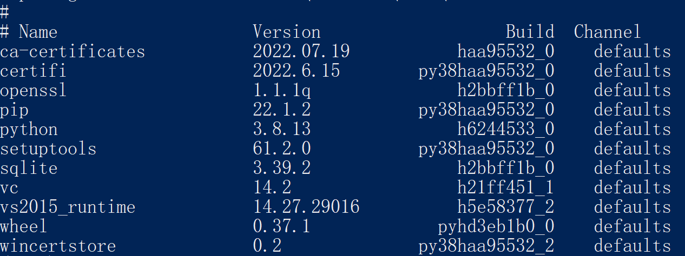</div>

可以看到，版本号为`3.8.13`的 python 已经成功安装在新环境下；另外，除了 python 之外，conda 还帮助我们安装了其他安装 python 所需的依赖（如`setuptools`等）。

此外，`conda install`命令不仅可以用来安装 python，其他各种 python 包也可以使用该命令进行安装，只需将 `python` 改为包的名字即可（如`numpy`, `PyQuery`等）。

### Pycharm 中使用 Conda

在日常的项目开发中，我们更多的是直接利用 Pycharm 启动一个 conda 环境进行开发，需要做的仅是在首次打开项目时进行简单的配置：

以 [GVasp](https://github.com/Rasic2/gvasp) 项目为例，我们首先利用 git 工具将项目代码 clone 到本地（关于 git 的安装及使用可以看[这里](#git-相关)）

```
git clone https://github.com/Rasic2/gvasp.git ./gvasp
```

然后将下载好的 gvasp 项目文件夹拖到 Pycharm 里打开，点击右下角的`Python解释器`（初次打开是`No interpreter`），如图中右下角红色框的位置：

<div align=center>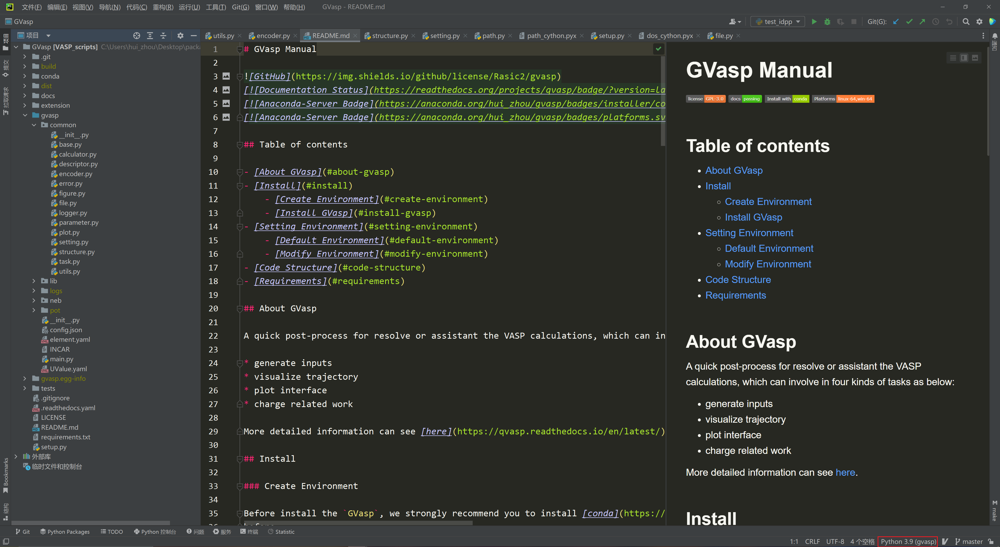</div>

点击之后，选择`添加解释器-Conda环境-现有环境`，如图：

<div align=center>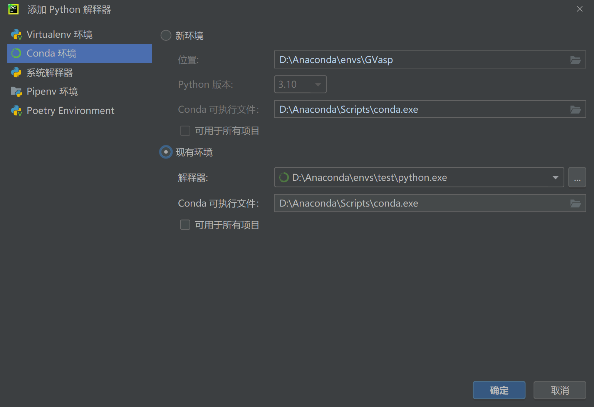</div>

在`解释器`位置更改你想修改的 conda 环境，选择之后点击确认，项目的 conda 环境就配置好了。

配置好 conda 环境后，如果后续想进行 conda 包的安装，可以直接利用 Pycharm 自带的 PowerShell 窗口进行操作，无需单独启动 `PowerShell` 了。

**note**

> 在 Pycharm 中使用 Powershell 可以点击 Pycharm 底部菜单栏的终端启动 Powershell（小箭头选择）

## 项目开发相关知识

### Git 相关

下面我们将简单介绍 `git` 相关的命令以方便新手学习如何使用 `git` 工具进行项目代码的管理。

对于项目开发来说，经常会涉及到多人合作开发一个项目，因此需要一种工具来管理代码开发的整个过程，涉及代码的修改历史，版本回溯，分支合并等各个方面，这也就是 `git` 工具产生的原因，而 `github` 则是一个代码托管的平台。如果对 `git` 及 `github` 的原理及更多应用感兴趣，可以自行搜索学习。

#### Git 安装

> 使用 conda 可以很容易的进行 git 工具的安装(`conda install git`)

#### Git 常用命令

- 下载别人的项目代码

```
git clone https://github.com/Rasic2/gvasp.git ./gvasp
```

其中 `https:*` 代表你想下载的项目代码，`./gvasp` 代表你想把代码下载到本地的哪个位置。

- 初始化自己的仓库

```
git init
```

- 查看当前项目仓库的配置

```
git config -l
```

- 将当前目录下的所有文件加入历史追踪

```
git add .
```

- 将当前所作的修改保存为一次本地版本更新

```
git commit -m "comment"
```

其中 `comment` 表示你对本次修改的一个批注。

- 查看当前项目代码的历史日志

```
git log
```

- 给远程仓库起一个别名

```
git remote add origin git@github.com:Rasic2/gvasp.git
```

其中 `origin`代表远程仓库地址的一个别名，`git@github*`代表远程仓库的地址。

- 将本地的最新版本同步到远程仓库

```
git push origin master
```

其中 `origin`代表远程仓库地址的一个别名，`master`代表一个代码分支的名字。

- 将远程仓库的最新代码同步到本地

```
git pull origin master
```

- 暂存工作区的代码到缓存区

```
git stash
```

- 查看缓存区记录

```
git stash list
```

- 将缓存区的第一条记录恢复到工作区

```
git stash pop
```

由于 git 相关的知识较为丰富，本说明仅列了较为常用的 git 命令，更多相关的知识可以参考下述链接学习。

#### 更多参考资源

[1. 常用 Git 命令总结](https://zhuanlan.zhihu.com/p/384819351)

[2. Git 教程](https://www.runoob.com/git/git-tutorial.html)

[3. Git reset 命令的使用](https://www.jianshu.com/p/cbd5cd504f14)

[4. 细读 Git | 让你弄懂 origin、HEAD、FETCH_HEAD 相关内容](https://developer.aliyun.com/article/919354)

[5. GitHub fork 与 pull request](https://blog.csdn.net/benben0729/article/details/83031135)

### 镜像资源修改

#### Conda 镜像修改

对于 conda，由于国外资源连通率太低，我们通常会使用 conda 的国内镜像资源，方法是在`Users`目录下（如 C:\Users\hui_zhou）新建一个`.condarc`文件，并修改如下（使用清华镜像）：

```
show_channel_urls: true
default_channels:
  - http://mirrors.tuna.tsinghua.edu.cn/anaconda/pkgs/main
  - http://mirrors.tuna.tsinghua.edu.cn/anaconda/pkgs/r
  - http://mirrors.tuna.tsinghua.edu.cn/anaconda/pkgs/msys2
  - https://mirrors.tuna.tsinghua.edu.cn/anaconda/cloud/pytorch/
```

#### Pip 镜像修改

对于少数没有上传到 conda 的 Python 包，当使用 pip 进行安装时，也需要使用国内的镜像资源进行加速，方法是在用户目录下新建`.pip/pip.conf`文件（先建一个`.pip`文件夹），然后修改如下（使用阿里镜像）：

```
[global]
index-url = https://mirrors.aliyun.com/pypi/simple
```

### Python 性能测试

当使用 Python 编写代码遇到性能问题需要进行优化时，第一步就是要找到制约性能的瓶颈，推荐使用的工具是 `line_profiler`，他可以对 Python 代码的逐行分析同时给出分析报告，类似下图所示：

<div align=center>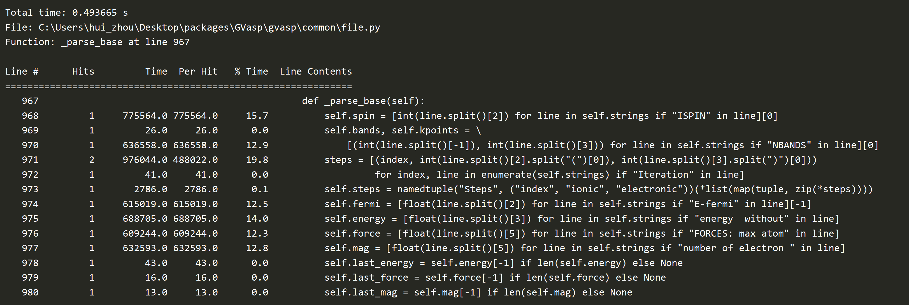</div>

#### line_profiler 安装

因为该工具是 Python 的第三方模块，所以可通过 pip 直接进行安装：

```
pip install line_profiler
```

#### line_profiler 使用

使用该工具进行性能测试时，只需`import`该模块，然后将想要进行性能测试的代码写到一个函数里（例如`main`函数），将函数名传给`LineProfiler`即可，例如：

```
import line_profiler

from common.file import XSDFile, OUTCAR


def main():
    XSDFile.write(contcar="CONTCAR", outcar="OUTCAR")


if __name__ == '__main__':
    profile = line_profiler.LineProfiler()
    profile.add_module(OUTCAR)
    profile_wrapper = profile(main)
    profile_wrapper()
    profile.print_stats()
```

该示例中首先实例化一个`LineProfiler`类，然后将`main`函数名传给这个可调用的实例（此处是`profile`）进行包装，最后便可以打印出性能测试报告。

推荐该工具主要是因为他有两个特别好用的 API，一个是`add_module`，它可以分析`main`函数调用过程中某个模块的性能；另一个是`add_func`，它可以分析`main`函数调用过程中某个函数的性能。利用这两个 API，我们便可以很容易的对 Python 的代码进行性能分析和优化，例如借助 [Cython](https://cython.org/)、[pybind11](https://pybind11.readthedocs.io/en/stable/index.html) 等工具编写 C/C++ 接口来提高 Python 本身的性能。

## 常用软件介绍

本部分主要介绍项目开发过程中可能用到的计算或建模软件。

### Open Babel

[Open Babel](https://openbabel.org/wiki/Main_Page) 是一个化学工具箱，对来自分子建模、化学、固态材料、生物化学或相关领域的数据提供搜索、转换、分析或存储等多种多样的功能，其 GitHub 主页可以看[这里](https://github.com/openbabel/openbabel)。

#### 安装

使用 conda 可以很容易的进行 `openbabel` 的安装，执行以下命令：

```
conda install -c conda-forge openbabel
```

因为 `openbabel` 在生成结构文件时需要读取自身的力场文件，因此需要设置环境变量 `BABEL_DATADIR` 为 `openbabel` 的目录（[如何设置环境变量看这](#anaconda-的安装)），如：

```
> set BABEL_DATADIR=D:\Anaconda\envs\WOS\share\openbabel
```

之后在 powershell 中执行`obabel -V`得到类似下面的版本信息就代表安装成功了：

```
> Open Babel 3.1.0 -- Jun 13 2022 -- 01:55:07
```

#### 常用命令

- 根据 `Smiles` 生成加氢后的 `mol` 文件

```
obabel -:C --gen3d -omol -O C.mol
```

其中，-:后面接 Smiles，--gen3d 指明利用力场优化分子坐标生成 3d 结构，-o 后面接生成文件的格式（可不加），-O 指明生成的文件名（带后缀）

运行上述命令后，可以得到 CH<sub>4</sub>分子的 mol 文件，如下所示：

```

 OpenBabel08302220183D

  5  4  0  0  0  0  0  0  0  0999 V2000
    1.0543   -0.0566   -0.0620 C   0  0  0  0  0  0  0  0  0  0  0  0
    2.1465   -0.0566   -0.0620 H   0  0  0  0  0  0  0  0  0  0  0  0
    0.6903    0.4246    0.8484 H   0  0  0  0  0  0  0  0  0  0  0  0
    0.6903   -1.0857   -0.1003 H   0  0  0  0  0  0  0  0  0  0  0  0
    0.6903    0.4911   -0.9339 H   0  0  0  0  0  0  0  0  0  0  0  0
  1  2  1  0  0  0  0
  1  3  1  0  0  0  0
  1  4  1  0  0  0  0
  1  5  1  0  0  0  0
M  END
```

**note**

> 注意 mol 文件的空行

使用 GaussView 打开该 mol 文件，即可得到一个 CH<sub>4</sub>分子的模型，如图：

<div align="center"></div>

## 学习资料推荐

### Python 编程语言

#### 《Python 编程从入门到实践》

<div align="center">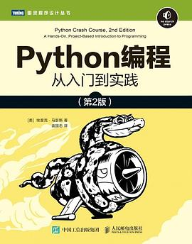</div>

本书适合零基础的读者作为学习 Python 的入门书籍，全书通过对 Python 基本语法和简单案例的讲解，能让读者快速掌握 Python 的核心编程概念，并增强学习 Python 的信心和兴趣。但是，本书作为零基础的入门书籍，涉及的 Python 知识点不够，没有着力于培养面向对象编程的思想，读者在理解基础语法后，需要结合[《Python 基础教程》](#python-基础教程)补充知识点与实战训练。此外，书中的实战项目不太实用，可以略过。

> **建议阅读章节：第 1 章—第 10 章。**

- [点击下载《Python 编程从入门到实践》代码](https://download.ituring.com.cn/book/download/646f556e-220c-4aab-824f-0d2ea7d61a87)

#### 《Python 基础教程》

<div align="center"></div>

本书适合有一定编程语言基础的读者，全书囊括了 Python 所有重要的知识点，内容难度适中，并且作者着重强调抽象意识，有助于读者理解面向对象编程。书中也有部分有价值的实战项目，可用于在了解基础语法之后领会实际的项目编程逻辑，但美中不足的是本书中文版翻译质量较差，建议结合原书对照阅读。

> **建议阅读章节：第 1 章—第 11 章，第 20 章，第 22 章。**

- [点击下载《Python 基础教程》英文版](https://libgen.rocks/get.php?md5=1ad21aa4a661ab666476ee2bc7d499cf&key=9CRH30QJRYL3VQ6Y)

- [点击下载《Python 基础教程》代码](https://download.ituring.com.cn/book/download/5ae84b8c-8bb0-48c7-af26-f749e56c761c)

#### 《流畅的 Python》

<div align="center">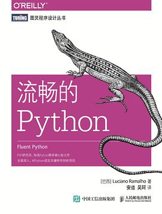</div>

Python 进阶书籍之一。本书着重讲解 Python 编程语言的特性和设计思路，从 Python 的角度出发满足各类需求，能够培养读者以 Python 的风格进行编程。全书分为序章、数据结构、函数、类、控制流以及元编程六个部分，其中前三部分对于数据科学方向的 Python 实践帮助很大，后三部分更适合用于学习 Python 软件开发。如果在学习完前两本推荐教材之后直接阅读本书，可能会有一定挑战性，可以先学习一些相对简单的章节，后续再在项目实践的过程中同步学习。

此外，本书的案例相对偏少，建议配合[《Python Cookbook》](#python-cookbook)同步阅读；如果想深入了解数据结构，可以参考[《算法导论》](#算法导论)的数据结构部分进行学习。

> **前期建议阅读章节：第 1 章~第 3 章，第 5 章。**

- [点击下载《流畅的 Python》代码](https://github.com/fluentpython/example-code/archive/refs/heads/master.zip)

#### 《Python Cookbook》

<div align="center">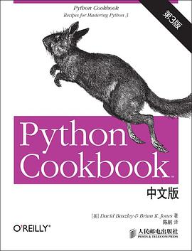</div>

Python 进阶书籍之一。本书是典型的字典类教材，提供了解决各类实际问题的框架和技巧，但是略微欠缺系统性。推荐读者在基本了解书中涉及哪些内容后，作为`工具书`使用，如果在工作中遇到相似问题，再进行查阅；也可以作为每日读物，每天学习 1-2 个解决问题的方法。

- [点击下载《Python Cookbook》代码](https://github.com/dabeaz/python-cookbook/archive/refs/heads/master.zip)

### Python 数据分析

#### 《Python 数据科学手册》

<div align="center">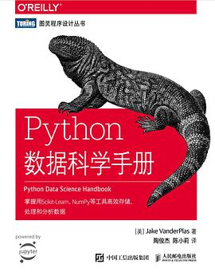</div>

本书主要介绍了 Python 在数据科学领域的几个常用工具: `Jupyter`,`Numpy`,`Pandas`,`Matplotlib`,`Scikit-Learn`。其中`Jupyter`提供日常数据处理的工作环境，`Numpy`用于储存和操作大型数据，`Pandas`处理带标签的大型数据，`Matplotlib`进行数据可视化，`Scikit-Learn`提供传统机器学习的实现。机器学习部分可以略过，[Python 机器学习](#python-机器学习) 部分有更详细教材。

> **建议阅读章节：第 1 章—第 4 章。**

- [点击下载《Python 数据科学手册》代码](https://github.com/jakevdp/PythonDataScienceHandbook/archive/refs/heads/master.zip)

#### 《利用 Python 进行数据分析》

<div align="center"></div>

本书大致内容与[《Python 数据科学手册》](#python-数据科学手册)相同，但本书的作者是`Pandas`的主要开发者，如果想从开发者角度了解`Pandas`，可以选择阅读本书。

- [点击下载《利用 Python 进行数据分析》代码](https://github.com/wesm/pydata-book/archive/refs/heads/3rd-edition.zip)

### Python 网络爬虫

#### 《Python3 网络爬虫开发实战》

<div align="center">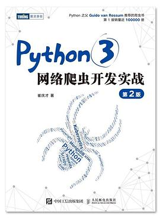</div>

本书对网络爬虫相关的各项内容都有所涉及，介绍了大量的 Python 库，对同一个问题也给出了多种解决方法，并且提供了爬虫实战网页，但内容略显冗杂，有堆料的嫌疑，适合作为工具书使用。

> **建议阅读章节：第 1 章—第 7 章。**

#### 《Python 网络爬虫权威指南》

<div align="center">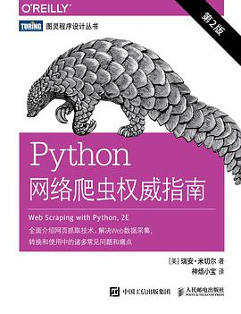</div>

本书作为轻量版的爬虫教程，清晰地阐述了爬虫思路和流程，并对可能遇到的问题给出了简要的解决方法，相较于前书，更着重于思路。

- [点击下载《Python 网络爬虫权威指南》代码](https://github.com/REMitchell/python-scraping/archive/refs/heads/master.zip)

### Python 机器学习

#### 《吴恩达机器学习 2022 版》(视频)

<div align=center>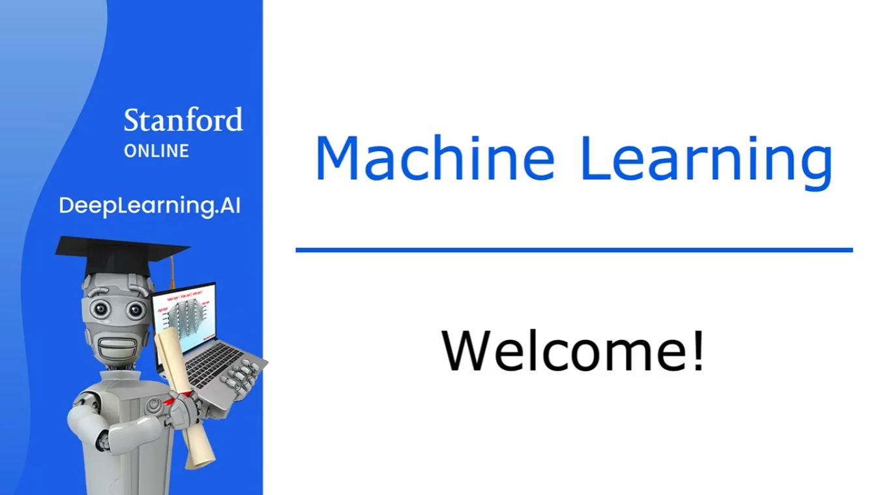</div>

吴恩达机器学习公开课十分适合初学者入门机器学习，该课程内容简单，涉及面广，并且只需要读者具备基础的数学知识。通过快速学习该课程，读者能够在短期内对各类机器学习概念有所了解。需要强调的是，虽然该课程对于模型概念和框架的理解很有帮助，但是实战内容（指示例代码）很少，需要结合实战材料一起学习。

- [Coursera 官网课程链接](https://www.coursera.org/specializations/machine-learning-introduction)

- [B 站 Up 主转载视频链接](https://www.bilibili.com/video/BV1Pa411X76s)

- [课程代码下载](https://github.com/kaieye/2022-Machine-Learning-Specialization/archive/refs/heads/main.zip)

#### 《机器学习实战：基于 Scikit-Learn、Keras 和 TensorFlow》

<div align="center">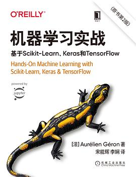</div>

本书专注于使用机器学习库进行实际操作，不过多涉及理论模型和实现方法，通过大量的实战代码，手把手教会读者真正从头开始训练机器学习模型的流程，是很适合初学者入门的实战教材。本书分为传统机器学习（如`Scikit-Learn`）和深度学习（如`Keras`、`TensorFlow`）两部分，由于项目开发更倾向于使用`PyTorch`框架，所以只建议阅读本书的机器学习部分。

> **建议阅读章节：第 1 章—第 9 章。**

- [点击下载《机器学习实战：基于 Scikit-Learn、Keras 和 TensorFlow》代码](https://github.com/ageron/handson-ml2/archive/refs/heads/master.zip)

#### 《深度学习入门：基于 Python 的理论与实现》

<div align="center">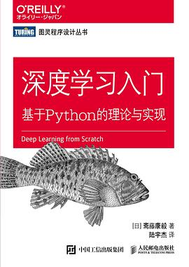</div>

本书短小精悍，仅用`Numpy`和 Python 标准库就完成了简单深度学习框架的从零实现，对深度学习的核心思想与数学模型也有精妙的阐述，让读者对深度学习框架的底层实现有充分了解，十分适合入门深度学习。

> **建议阅读章节：全部。**

- [点击下载《深度学习入门：基于 Python 的理论与实现》代码](https://github.com/oreilly-japan/deep-learning-from-scratch/archive/refs/heads/master.zip)

#### 《动手学深度学习》

<div align="center">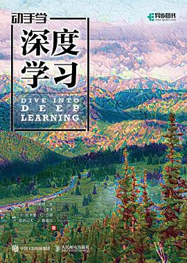</div>

本书介绍了深度学习所需的简要数学知识、各类深度学习模型框架、模型优化方法以及开展深度学习所需的硬件设施。新版教材使用`PyTorch`框架，由浅入深地讲解了近年来诞生的不同深度学习框架及其效率。另外，本书针对图像识别和自然语言处理两大深度学习的典型应用也附有专项的练习。同时，教材作者还在 [bilibili](https://space.bilibili.com/1567748478) 实时直播授课，组织课程竞赛，讲解论文，十分推荐读者结合 [bilibili](https://space.bilibili.com/1567748478) 视频同步学习。

> **建议阅读章节：全部。**

- [课程官网](https://zh-v2.d2l.ai/index.html)

- [PyTorch 版教材下载](https://zh-v2.d2l.ai/d2l-zh-pytorch.pdf)

### 拓展书目

#### 《C Primer Plus》

<div align="center"></div>

由于 Python 语言运行效率和内存的限制，以及大量库文件都用 C/C++语言实现，在实际工作中，不论是想提升工作代码的效率还是想阅读库文件源码，仅依靠 Python 语言的知识储备是无法满足需求的。相较于 Python，C 语言更加底层，因此，通过学习 C 语言，程序员也更能理解代码的运行逻辑。因此，我们建议读者在具有一定 Python 语言基础后学习 C 语言，以满足中大型项目或者核心库代码的开发需求。

#### 《概率导论》

<div align="center"></div>

由于机器学习本质上是基于概率模型的，所以在阅读文献或者教材时，不可避免地会遇到大量的统计学概念。因此，简要学习概率论，对于理解各类机器学习模型的工作原理以及阅读文献有重要帮助。

#### 《算法导论》

<div align="center"></div>

编程语言是解决问题的工具，而算法则是解决问题的方法。本书包含了基本的数据结构以及各种算法问题选编，通过对本书的学习，可以很大程度上拓宽读者利用程序解决问题的思路。虽然通读全书的难度曲线十分陡峭，但是我们还是建议读者至少掌握数据结构部分，以帮助读者在面对不同的需求时调用或编写适当的数据结构以简化问题。

#### 《统计学习方法》

<div align="center"></div>

本书主要介绍各类传统机器学习方法的数学原理，虽然我们十分不建议初学者把时间花在机器学习的数学解释上，但是如果读者希望能够从更深的理论角度解释选用当前机器学习模型的原因、优劣，或者改进机器学习模型，那么本书是很值得一看的。

#### 《深度学习》

<div align="center">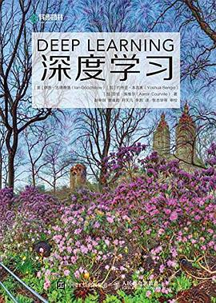</div>

与[《统计学习方法》](#统计学习方法)相似，本书主要介绍了深度学习的数学原理，因此，出于同样的理由，我们把本书作为深度学习的进阶教材进行推荐。

## 常用库介绍

在前面学习了相关 Python 基础语法及人工智能的相关知识后，下面对 Python 常用库进行简单的介绍，更加详尽的说明请参照[常用库的在线手册](#常用库的在线手册)一节。本教程目前仅介绍 [Scikit-Learn](https://scikit-learn.org/stable/index.html)，其他 Python 库的介绍后续会持续更新。

### Scikit-Learn

Scikit-Learn（简称 sklearn） 来源于 [Google Summer of Code](https://summerofcode.withgoogle.com/about)，是机器学习中最常用的`python`第三方模块，其对一些常用的机器学习方法进行了封装，这样使得我们在进行机器学习任务时，并不需要每个人都从头实现所有的算法，只需要简单的调用`sklearn`里的模块就可以实现大多数机器学习任务。

关于`sklearn`中代码用法和相关技术原理的介绍，我们首先要推荐的阅读材料是`sklearn`的中文文档，可以点击以下链接进行学习 (均为第三方翻译)：

- [Scikit-Learn 中文文档](https://www.sklearncn.cn/)
- [scikit-learn 官方文档中文版](https://sklearn.apachecn.org/)

推荐的第一份阅读材料是 sklearn 的中文文档，但是该文档翻译并不十分及时，现在更新到的版本是`0.19.x/0.21.x`。而 sklearn 的稳定发行版本号是`1.1.2`（2022.8），经过了七个版本的迭代，很多类和函数的使用方法也发生了变化，因此当遇到中文文档无法解决、解释不清的时候，我们推荐去翻阅最新的英文社区页面：

- [Scikit-Learn: Machine Learning in Python](https://scikit-learn.org/stable/)

相对应地，sklearn 也有翻译过的中文社区页面（对应`0.23.x`版本，更新不及时，而且一看就是机翻，并不推荐）：

- [Scikit-Learn 中文社区](https://scikit-learn.org.cn/)

通过阅览以上几个网页，我们就可以对`sklearn`的原理和用法有一定的了解，也可以上手使用这一软件包了。

### 为什么是 Scikit-Learn?

实际上，借助活跃的社区和开发公司的技术背景，一些同样成熟的软件包（例如`Pytorch`、`Tensorflow`）的代码效率、调用计算资源的能力确实会超过`sklearn`，但是，我们仍然能看到很多优秀的机器学习项目使用的是 sklearn，这是因为`sklearn`具有超高的易用性及封装度，使用者并不需要完全掌握从零开始手搓的代码，并且`sklearn`支持使用者自行对数据进行数据处理，例如特征选择，维度压缩，转换格式等。此外，对于很多中小型，特别是数据量不大的项目，这时更需要开发者手动对数据进行处理，选择模型，以及调试参数。这些都是`sklearn`十分擅长的。

总之，在机器学习领域，大家的首选一般是`sklearn`。如果涉及到深度学习/神经网络等，才会选用别的`package`。

### 快速上手 Scikit-Learn？

下面我们将对如何使用`sklearn`进行简单的说明。

要安装`sklearn`，只需要执行以下命令：

```
 pip install sklearn
```

对[面向对象的程序设计](https://www.runoob.com/python/python-object.html)有一定了解后，我们可以很方便地用相应的 API 调用 scikit-learn 的`@class`，并把它们在自己的程序中实例化，之后我们就可以直接使用已经开发好的机器学习相关程序。

下面对`sklearn`的常用`class`（按照机器学习建模过程中使用的先后顺序，即数据整理、模型选取、评价指标、模型调参、保存模型）进行介绍。

- [数据整理](#数据导入和整理筛选清洗)
- [模型选取](#选取机器学习模型)
- [评价指标](#判断模型优劣，比较模型性能)
- [模型调参](#模型调参)
- [保存模型](#保存模型)

#### 数据导入和整理（筛选、清洗）

`sklearn`处理的数据是存储为`numpy`数组或`scipy`稀疏矩阵的数字，或者`pandas`数据框等可以转换为数字数组的其他数据类型。因此在导入数据时，建议对数据做类似数组化的处理：

```
X = numpy.array(X)
```

数据整理是机器学习项目的第一步，只有在保证数据真实有效无噪声的情况下才能开始进行有效的机器学习建模。这就需要我们对输入的数据进行一定的预处理。具体有：

- 标准化：

```
sklearn.preprocessing.StandardScaler
```

- 归一化：

```
sklearn.preprocessing.Normalizer
```

- 二值化：

```
sklearn.preprocessing.Binarizer
```

- 编码分类特征：

```
sklearn.preprocessing.LabelEncoder
```

- 生成多项式特征：

```
sklearn.preprocessing.PolynomialFeatures
```

- 输入缺失值：

```
sklearn.preprocessing.Imputer
```

##### 划分训练集和测试集

在处理完数据后，我们通常会将手上的数据随机划分为训练集和测试集，比例一般为 7：3 或 8：2，sklearn 提供了以下方法：

```
sklearn.model_selection.train_test_split(X,y,random_state=0)
```

##### 调用内置的数据集

当我们手上没有数据集但是又想练手时，sklearn 也提供了几个小规模数据集，如 iris, diabetes, digits, covtype, kddcup99, boson, breast_cancer，都可以通过

```
sklearn.datasets.load_iris
```

或类似的方法加载。

#### 选取机器学习模型

在明确了机器学习需要解决的问题后，我们可以选用相应的模型来对数据进行建模了。然而，`sklearn`对这些方法的分类有点过于详细了，有的时候我们会想去测试好几个相应的模型，但是每次都要单独对相应方法进行一个面向搜索引擎的知识查找，因此接下来我们会按照解决机器学习问题（分类、回归、聚集）对应的的方法进行介绍。

##### 分类模型

- `KNN`最近邻:

```
sklearn.neighbors.KNeighborsClassifier
```

- `logistic regression`逻辑回归:

```
sklearn.linear_model.LogisticRegressionClassifier
```

- `svm`支持向量机:

```
sklearn.svm.SVC
```

- `Naive Bayes`朴素贝叶斯:

```
sklearn.naive_bayes.**
```

- `Decision Tree`决策树:

```
sklearn.tree.DecisionTreeClassifier
```

- `Neural network`神经网络:

```
sklearn.neural_network.MLPClassifier
sklearn.neural_network.MLPClassifier
```

##### 回归模型

- `线性 `

```
sklearn.linear_model.LinearRegression
```

- `Lasso`

```
sklearn.linear_model.Lasso
```

- `内核岭 `

```
sklearn.linear_model.Ridge
```

- `KNN `

```
sklearn.neighbors.KNeighborsRegressor
```

- `支持向量机 `

```
sklearn.svm.SVR
```

- `决策树 `

```
sklearn.tree.DecisionTreeRegressor
```

- `极限数 `

```
sklearn.tree.ExtraTreeRegressor
```

- `多层感知机 `

```
sklearn.neural_network.MLPRegressor
```

- `随机森林 `

```
sklearn.ensemble.RandomForestRegressor
```

- `AdaBoost `

```
sklearn.ensemble.AdaBoostRegressor
```

- `梯度提升 `

```
sklearn.ensemble.GradientBoostingRegressor
```

- `Bagging`

```
sklearn.ensemble.BaggingRegressor
```

##### 聚集模型

- `AgglomerativeClustering`: 层次聚类

```
sklearn.cluster.AgglomerativeClusterin(n_clusters=2, affinity='euclidean', memory=Memory(cachedir=None))
```

- `DBSCAN`

```
sklearn.cluster.DBSCAN(ps=0.5, min_samples=5, metric='euclidean')
```

- `KMeans`: K 均值聚类

```
sklearn.cluster.KMeans(n_clusters=8, init='k-means++', tol=0.0001, precompute_distances='auto')
```

##### 数据降维模型

- `NMF`:非负矩阵分解

```
sklearn.decomposition.NMF(n_components=*, init='random', random_state=*0*)
```

- `PCA`:主成分分析

```
sklearn.decomposition.PCA(n_components=*2*)
```

#### 判断模型优劣，比较模型性能

首先，我们有一个`通用`的方法，称为`交叉验证`：

```
sklearn.cross_validation.cross_val_score(estimator,X_train,y_train,cv=kfold,score=***)
```

其中，对于不同的机器学习方法，可选的 scoring 指标有：
| Scoring | Function | Comment |
|--------------------------------------|----------------------------------------|--------------------------------|
| **Classification** | | |
| ‘accuracy’ | metrics.accuracy_score | |
| ‘balanced_accuracy’ | metrics.balanced_accuracy_score | |
| ‘top_k_accuracy’ | metrics.top_k_accuracy_score | |
| ‘average_precision’ | metrics.average_precision_score | |
| ‘neg_brier_score’ | metrics.brier_score_loss | |
| ‘f1’ | metrics.f1_score | for binary targets |
| ‘f1_micro’ | metrics.f1_score | micro-averaged |
| ‘f1_macro’ | metrics.f1_score | macro-averaged |
| ‘f1_weighted’ | metrics.f1_score | weighted average |
| ‘f1_samples’ | metrics.f1_score | by multilabel sample |
| ‘neg_log_loss’ | metrics.log_loss | requires predict_proba support |
| ‘precision’ etc. | metrics.precision_score | suffixes apply as with ‘f1’ |
| ‘recall’ etc. | metrics.recall_score | suffixes apply as with ‘f1’ |
| ‘jaccard’ etc. | metrics.jaccard_score | suffixes apply as with ‘f1’ |
| ‘roc_auc’ | metrics.roc_auc_score | |
| ‘roc_auc_ovr’ | metrics.roc_auc_score | |
| ‘roc_auc_ovo’ | metrics.roc_auc_score | |
| ‘roc_auc_ovr_weighted’ | metrics.roc_auc_score | |
| ‘roc_auc_ovo_weighted’ | metrics.roc_auc_score | |
| **Clustering** | | |
| ‘adjusted_mutual_info_score’ | metrics.adjusted_mutual_info_score | |
| ‘adjusted_rand_score’ | metrics.adjusted_rand_score | |
| ‘completeness_score’ | metrics.completeness_score | |
| ‘fowlkes_mallows_score’ | metrics.fowlkes_mallows_score | |
| ‘homogeneity_score’ | metrics.homogeneity_score | |
| ‘mutual_info_score’ | metrics.mutual_info_score | |
| ‘normalized_mutual_info_score’ | metrics.normalized_mutual_info_score | |
| ‘rand_score’ | metrics.rand_score | |
| ‘v_measure_score’ | metrics.v_measure_score | |
| **Regression** | | |
| ‘explained_variance’ | metrics.explained_variance_score | |
| ‘max_error’ | metrics.max_error | |
| ‘neg_mean_absolute_error’ | metrics.mean_absolute_error | |
| ‘neg_mean_squared_error’ | metrics.mean_squared_error | |
| ‘neg_root_mean_squared_error’ | metrics.mean_squared_error | |
| ‘neg_mean_squared_log_error’ | metrics.mean_squared_log_error | |
| ‘neg_median_absolute_error’ | metrics.median_absolute_error | |
| ‘r2’ | metrics.r2_score | |
| ‘neg_mean_poisson_deviance’ | metrics.mean_poisson_deviance | |
| ‘neg_mean_gamma_deviance’ | metrics.mean_gamma_deviance | |
| ‘neg_mean_absolute_percentage_error’ | metrics.mean_absolute_percentage_error | |
| ‘d2_absolute_error_score’ | metrics.d2_absolute_error_score | |
| ‘d2_pinball_score’ | metrics.d2_pinball_score | |
| ‘d2_tweedie_score’ | metrics.d2_tweedie_score | |

对于不同的机器学习方法，有不同的评估模型性能的方法，有的是综合指标，有的就是把上面的 scoring 方法写成了`@metrics`里的函数，如下所示：

##### 分类指标

- 准确率：

```
sklearn.metrics.accuracy_score(y_test,y_pred)
```

- 分类预估评价函数：

```
sklearn.metrics.classification_report(y_test,y_pred)
```

- 混淆矩阵（准确率、召回率、f1 分数以及支持率）：

```
sklearn.metrics.confusion_matrix(y_test,y_pred)
```

##### 回归指标

- 平均绝对误差（准确程度）：

```
sklearn.metrics.mean_absolute_error(y_test,y_pred)
```

- 均方误差（准确程度）：

```
sklearn.metrics.mean_squared_error(y_test,y_pred)
```

- R<sup>2</sup> 评分（线性程度）：

```
sklearn.metrics.r2_score(y_test,y_pred)
```

##### 聚类指标

- 调整兰德系数:

```
sklearn.metrics.adjusted_rand_score(y_test,y_pred)
```

- 同质性：

```
sklearn.metrics.homogeneity_score(y_test,y_pred)
```

- V-measure:

```
sklearn.metrics.v_measure_score(y_test,y_pred)
```

#### 模型调参

在这一部分，我们首先需要使用者对机器学习模型中的`参数`和`超参数`有一定的概念。换句话说，我们在调参时，首先要知道我们具体在对模型的什么特征做修改。这部分概念应该在学习基础课程时已经了解到，即固定一个评价指标，查看不同超参数下模型的返回值，并找到在给定超参数空间下全局最优的结果。如果对调参过程的目的和方法进行总结，可以表述为：

> 借助合适的评价指标，优化选定模型在处理特定问题时的超参数，来提高模型的泛化能力

具体地，sklearn 提供了`网格搜索`和`随机参数优化`的方法，但实际上一般会采用更优秀的调参方法，使得实际搜索的超参数空间更小，搜索的局部最优值更低。一般使用的是 `bayes-opt` 或者 `hyperopt` 程序包，也有将调参方法和机器学习结合的 `XGBoost` 程序包等，后续我们也会介绍这些更先进的方法。这里我们主要介绍 sklearn 内置的调参方法：

- 网格搜索：

```
params = {
            "n_neighbors": numpy.arrange(1,3),
            "n_estimators": range(10,1000),
         }
grid = sklearn.grid_search.GridSearchCV(estimator=***, param_grid=params)
grid.fit(X_train, y_train)
```

- 随机参数优化:

```
params = {
            "n_neighbors": numpy.arrange(1,3),
            "n_estimators": range(10,1000),
         }
random_search = sklearn.grid_search.RandomizedSearchCV(estimator=***, param_distributions=params)
random_search.fit(X_train, y_train)
```

#### 保存模型

在经历了以上步骤后，我们的机器学习模型就完成了！最后需要做的一件事就是，把我们训练好的模型保存下来。

- 读取：

```
sklearn.externals.joblib.dump(*name,*path)
```

- 保存：

```
*name = sklearn.externals.joblib.dump(*path)
```

**note**

> 需要注意的是，以上介绍的均为伪代码，在实际使用中当我们想向引用的 class 传入参数时，请一定在自己的脚本或程序中预先实例化！

以上就是对 sklearn 的基本介绍。

## 常用库的在线手册

- [Numpy 中文文档](https://www.numpy.org.cn/)
- [Pandas](https://pandas.pydata.org/docs/user_guide/index.html#user-guide)
- [Matplotlib](https://matplotlib.org/stable/tutorials/index.html)
- [Scikit-Learn 中文文档](https://www.sklearncn.cn/)
- [Scikit-Learn 官方文档中文版](https://sklearn.apachecn.org/)
- [PyTorch](https://pytorch.org/docs/stable/index.html)
- [RDKit 中文文档](http://rdkit.chenzhaoqiang.com/overview.html)

## 奇怪的技巧

- 当运行网易云音乐时，Pycharm 进行格式化的快捷键`Ctrl+Alt+L`会失灵

## 贡献者

[Hui Zhou](https://github.com/Rasic2), [DongZhi Li](https://github.com/kealdoom), [XianYang Zhang](https://github.com/mastreina)

## 版权

本教程的版权归 [GongGroup](https://github.com/GongGroup) 所有，更新维护工作暂由 [Hui Zhou](https://github.com/Rasic2) 及 [DongZhi Li](https://github.com/kealdoom) 负责。
